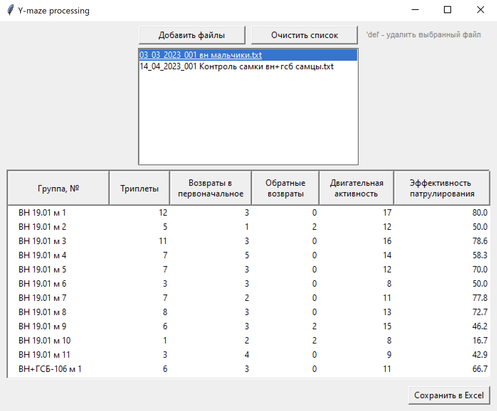
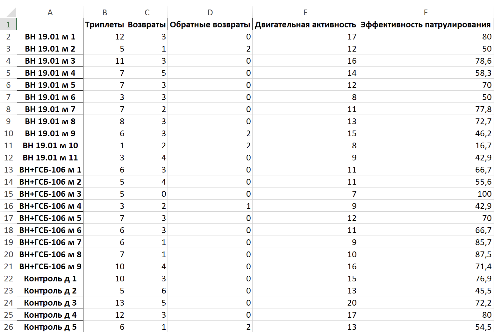

### SL-Asyl

## Y-maze


Проба пера для упрощения моих и коллег рабочих будней.

Суть проста: по протоколу забиваются данные эксперимента через RealTimer и вместо подсчёта вручную отправляются в Y-maze, на выходе получаем .xlsx, из которого можно брать данные для статистической обработки.

Реализован предпросмотр данных, возможность их пофайлового и массового добавления и удаления, обработка ситуаций с невалидными файлами.

Программа локальная, поэтому реализована исключительно под Windows с одной лишь функцией обсчета данных из файлов и вычисления пары параметров.

##



##




```plaintext                                                                         `<                 
                                                                        `;                  
                                                                        -  ``>              
                                                            ``           ````   `  ````     
                                                             ` `    ```9&`/9:`%``           
                                                        ```  `'```.8```,``'``'+``           
                                                  ```      `: `#`` `<`````->,``             
                                                 `/-'```#``!#``:&`;` ` ```%9````<           
                                                 `#    `!#` ``#+`     ``!`;`` `             
                                                 `>.` ..` ``:`          `!  .`              
                                               ``#`+`:!``8`           ```   `'              
                                               `**`,.```.?.          `.<`                   
                                               `+```: >`+%-     `  ``;!                     
                          ````               ``&: `#``:.<`:```<*%%,```%                     
                    `,#%,.`  `````>8#?.`````,#*`          `     >`;  `.                     
                  `'/                                            :   #                      
                `&.                                                 `#                      
              `-?                                  ``              ``!`                     
          ```8.'                                   `                 !`                     
         -%                   ``.` `               ``                '`                     
        `8    `                     `'              `.```    ``` ``  `#`````                
        #     `                                         ` `        `` ,`` `9#`              
       `.                                `                          ` #9##:`*+              
      `#                                 `.`                        `8`  &#+8`              
      `'                                                            `+`                     
      ,`                                    ` ``+``.>              `*                       
      %*                                     `;    `<            ```                        
      >'                                    `+`     `, `        `<`                         
       8`                                   ,           `;    `````                         
       `!    `9                             &`,#####8?9#-.!```/%.`                          
        .`   `?`+                          ``:`        ``  `-#`  `<`                        
        `%```;%%'``                       ``%````             `9  ``88%`.`  ``.             
         '`&<    `/!` `                 `%#;```%>;.```*8`      `#  `.'``';8# `# #`          
        `#`!`       `.8'``   ``     ```%.` ``` ```.+%8```       ``#.??;`&<`  `< #`          
        ``8#`         ` ` 9;########++,``` `    ``                    `    `-< `#           
           `;`            ```#;` ``                                    ```#+  `#            
```